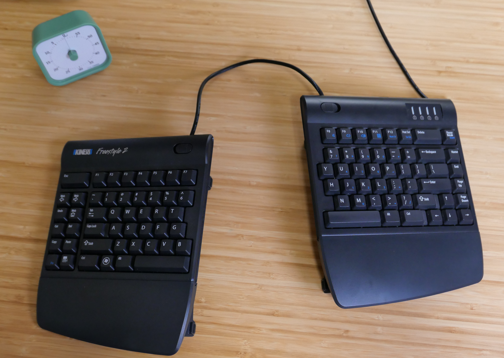
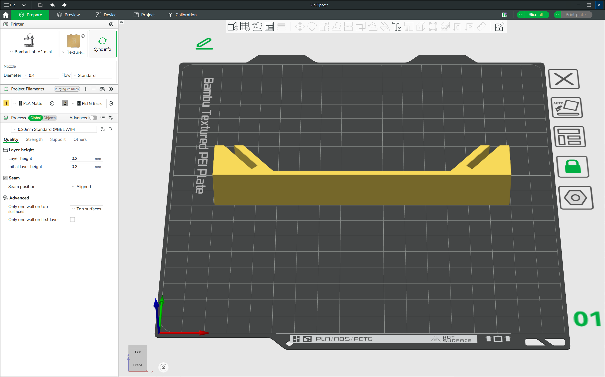

# Kinesis Split Keyboard Leash

I’ve been using a [Kinesis Freestyle 2 ergonomic split keyboard](https://kinesis-ergo.com/shop/freestyle2-for-pc-us/) with the [VIP3 tenting accessory](https://kinesis-ergo.com/shop/freestyle2-vip3-accessory/) as my daily driver at both work and home since 2012\.

The Kinesis Freestyle 2 VIP3 tenting accessory includes palm supports and multiple hinged “v-lifters” to allow the user to configure a slope of five-, ten-, or fifteen-degrees of tenting. I configure my keyboard to use fifteen degrees of tenting as this is most comfortable to me.

This keyboard is far from perfect but it is good enough and after fourteen years of use, it is very familiar to me.

## Problem

One problem I have had with this keyboard, since the beginning, is the two halves tend to drift apart with use. The drift can vary depending on desk finish and which variant of the rubber feet are installed on the lifters.

Fourteen years later, I finally did something about it\! I designed and 3D printed an effective minimalistic spacer bracket.

I’ve searched the internet several times over the year for existing 3D printable designs to address this problem. I’ve found a few accessories but they tend to have the following deficiencies.

- Large structures and print volumes  
- User complaints about moving or falling off mounts  
- Not compatible with existing VIP3 tenting accessories  
- Not designed for use with fifteen-degree VIP3 tenting

I tried to keep the design as simple as possible as I’m a beginning modeler and I wasn’t sure how effective my first approach would be at solving my problem.

## Design Solution

### Locking Mechanism

In the spirit of simplicity, I choose a friction wedge retention mechanism to secure the two keyboard halves. This means no fancy locking features or hardware. Instead I’m using the natural angle of the existing VIP3 tenting feature and the weight of the keyboard to create a self locking feature.

This locking feature strongly resists the two keyboard halves from moving closer or further apart from each other in the horizontal direction. However, the locking feature is less effective at resisting the two halves from moving forward or back relative to each because the tenting feature can slide more easily in the slot in that direction.

### Separation Distance

To keep the design simple and aesthetically clean, I used a fixed separation distance of 100 mm. This distance is measured relative to the bottom of the tenting feature.

The working distance can be changed in the model with adjustment of a single half distance sketch dimension.

### Tenting

I did not find an obvious way to use this locking mechanism and simultaneously support all three tenting configurations. As such, this design only supports the fifteen-degree configuration.

To support five- and ten-degree tenting options, additional variants of this design would be required.

## Implementation

I implemented the design using a no cost non-commercial version of Fusion 360.

A single sketch defining a single side of the bracket does most of the work. The sketch is extruded, chamfered and then mirrored as a single body.

The net effect is well behaved and fully constrained model fully defined by a handful of dimensions. The constraints are implemented in an intuitive and aesthetically pleasing way. No surprises here. This means the final model body naturally updates when dimensions in the sketch are modified.

During early prototyping, I scaled back several of the sketch parameters and cut the design in the slicer to minimize volume of test coupons.

I made the final prints with the following configuration.

- Bambu Labs A1 Mini  
- Lay design on long side face  
- .04 mm nozzle, standard flow  
- PLA Matte Orange  
- 0.2 mm layer height  
- 2 wall loops  
- 5 top shell layers  
- Sparse 15% infill

## Conclusion

I ended up printing and installing two of these brackets for increased stability.

If I could make one additional improvement, it would be to add some recessed features to accept additional rubber pads in the bracket. It is not a big deal, but as dust builds up on surfaces it will likely help reduce movement even further.

I've very happy with the results. The brackets have a minimal appearance once installed and drastically minimize keyboard drift throughout the day!

### Features

- No modification needed to keyboard or tenting accessories  
- Low profile self locking retention mechanism
- Quick print, minimal volume, no supports  
- Easy to modify via fully symmetric sketch driven design

### Weaknesses

- Fixed distance between split halves.  
- Design changes required to accommodate five- and ten-degree lifters.  
- No easy way to add rubber feet to brackets to further reduce drift.  
- The brackets are not perfectly rigid, some movement is still possible. May need to use two brackets to stabilize.
