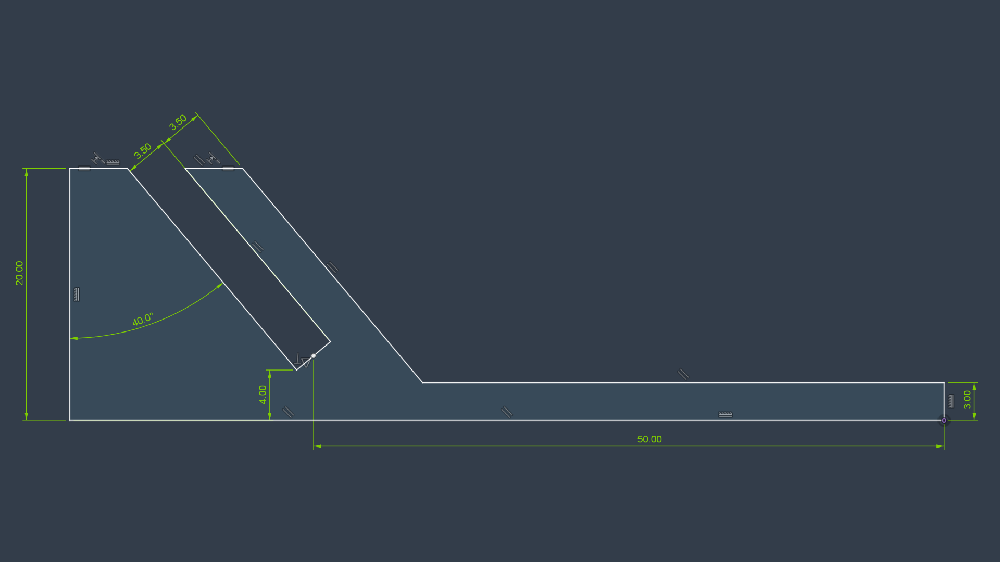

# Leashing a Kinesis Split Keyboard

I’ve been using a [Kinesis Freestyle 2](https://kinesis-ergo.com/shop/freestyle2-for-pc-us/) split keyboard with the optional [VIP3 tenting accessory](https://kinesis-ergo.com/shop/freestyle2-vip3-accessory/) at work and home since 2012.

This keyboard is far from perfect but it is good enough for me and after fourteen years of use, it is also very familiar.

## Problem

The biggest problem I have with this keyboard is the two halves tend to drift apart with use. The drift can vary depending on desk finish, cleanliness, and which rubber feet are installed underneath.

I have searched the internet several times over the years for existing 3D printable designs to address this problem. I’ve found a few accessories but they tend to have the following deficiencies.

- Large structures and print volumes  
- User complaints about moving or falling off mounts  
- Not compatible with existing VIP3 tenting accessories  
- Not designed for use with fifteen-degree VIP3 tenting

Fourteen years later, I finally did something about it! I designed and 3D printed an effective minimalistic spacer bracket.

## Design Solution

I tried to keep the design as simple as possible as I am a beginning modeler and I was not sure how effective my first approach would be at solving the problem.

### Locking Mechanism

In the spirit of simplicity, I chose a friction wedge retention mechanism to secure the two keyboard halves. This means no fancy locking features or hardware. Instead I’m using the natural angle of the existing VIP3 tenting feature and the weight of the keyboard to create a self-locking mechanism.

This locking mechanism strongly resists the two keyboard halves from moving closer or further apart from each other in the horizontal direction. However, the mechanism is less effective at resisting the two halves from moving forward or back relative to each other because the tenting feature can slide more easily in the slot in that direction.

### Tenting

The Kinesis Freestyle 2 VIP3 accessory kit can be configured to five-, ten-, or fifteen-degrees of tenting. I set mine to 15-degrees and have for years.

I did not find an obvious way to apply the locking mechanism to simultaneously support all three tenting configurations. As such, this design only supports the fifteen-degree option.

To support five- and ten-degree tenting options, additional variants of this design would be required.

### Separation Distance

To keep the design simple and aesthetically clean, I chose to use a fixed separation distance of 100 mm. This distance is measured relative to the bottom of the tenting feature and is roughly what I have used for years.

If needed, the distance can be changed in the model by updating a single half distance sketch dimension without side effects.

## Implementation

I implemented the design using the no-cost, non-commercial version of Fusion 360.

A single sketch defining one side of the bracket does most of the work. This single sketch is then extruded, chamfered and then mirrored as a single body.

The net effect is a well-behaved and fully constrained model defined by a handful of dimensions. The final solid body naturally updates when dimensions in the sketch are modified.

During early prototyping, I scaled back several of the sketch parameters and cut the design in the slicer to minimize volume of test coupons.

I made the final prints with the following configuration.

- Bambu Labs A1 Mini  
- Lay design on long side face  
- 0.4 mm nozzle, standard flow  
- PLA Matte Orange  
- 0.2 mm layer height  
- 2 wall loops  
- 5 top shell layers  
- Sparse 15% infill

## Conclusion

For increased stability, I printed and installed two of these brackets. They fit like a glove and are easily removed.

### Features

- No modification needed to keyboard or tenting accessories  
- Low-profile self-locking retention mechanism
- Quick print, minimal volume, no supports  
- Easy to modify via fully symmetric sketch-driven design

### Weaknesses

- Fixed distance between split halves.  
- Design changes required to accommodate five- and ten-degree lifters.  
- No easy way to add rubber feet to brackets to further reduce drift.  
- The brackets are not perfectly rigid, some movement is still possible. May need to use two brackets to stabilize.

If I make any additional refinements now, it would be to add recessed features to accept rubber feet. Having additional rubber feet will help resist movement as dust builds up on desk surfaces.

I am pleased with the results. The brackets have a minimal appearance when installed. Most importantly, they solve the problem by drastically minimizing keyboard drift throughout the day!
