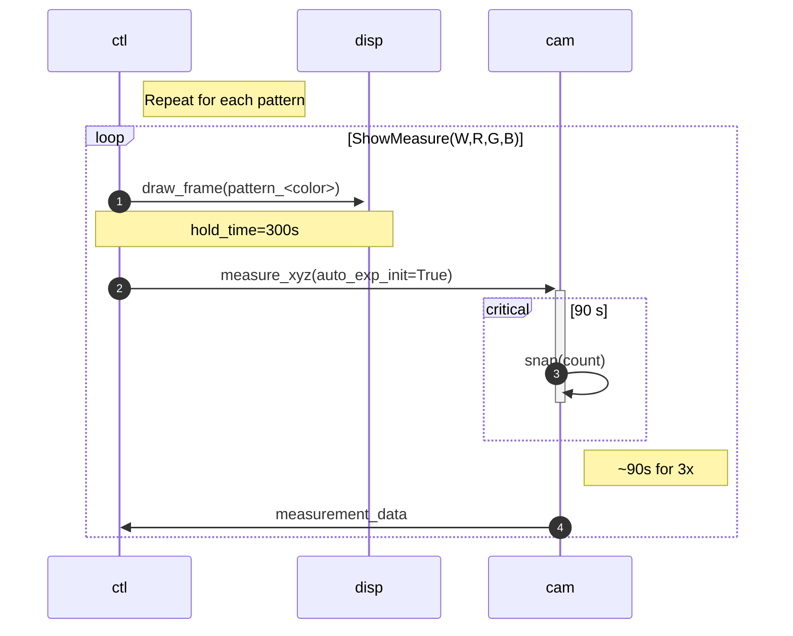
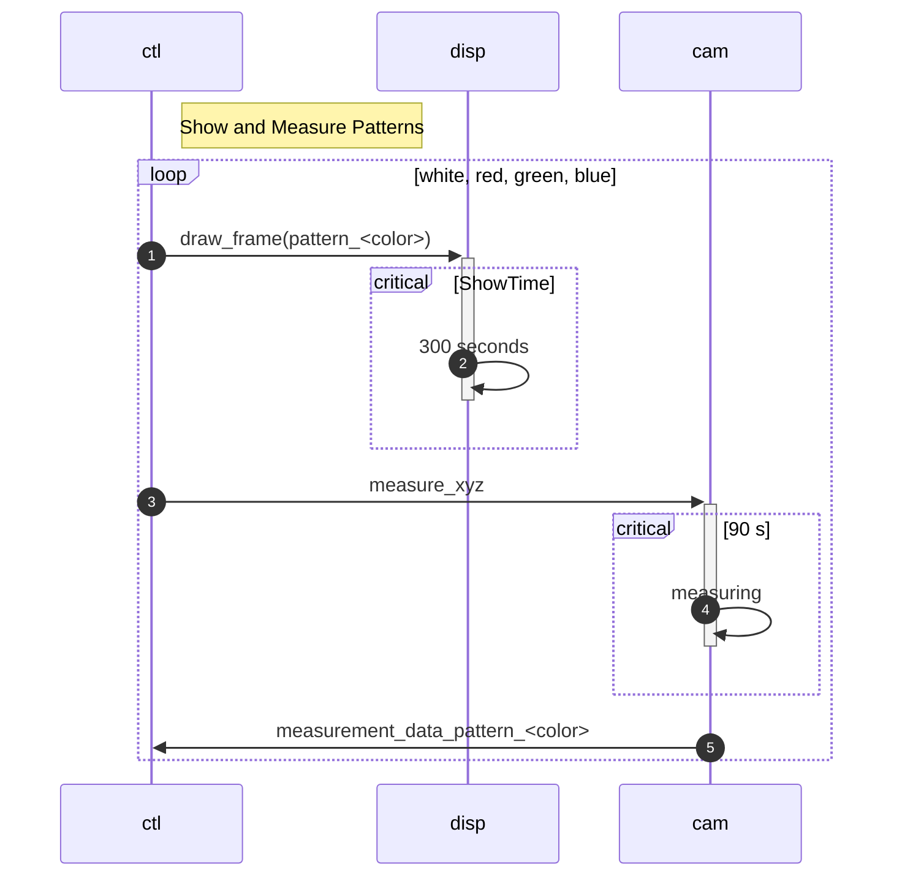

# Sequence Diagrams

- <https://mermaid.ai/blog/posts/sequence-diagrams-the-good-thing-uml-brought-to-software-development>
- <https://jessems.com/posts/2023-07-22-the-unreasonable-effectiveness-of-sequence-diagrams-in-mermaidjs/>
- <https://marketplace.visualstudio.com/items?itemName=bierner.markdown-mermaid&ssr=false#overview>
- <https://code.visualstudio.com/updates/v1_121#_mermaid-diagrams-in-markdown-preview-and-notebooks>
  - Mermaid new supported markdown preview language in VS Code 1.121!!! No more plugins required

## Demo

